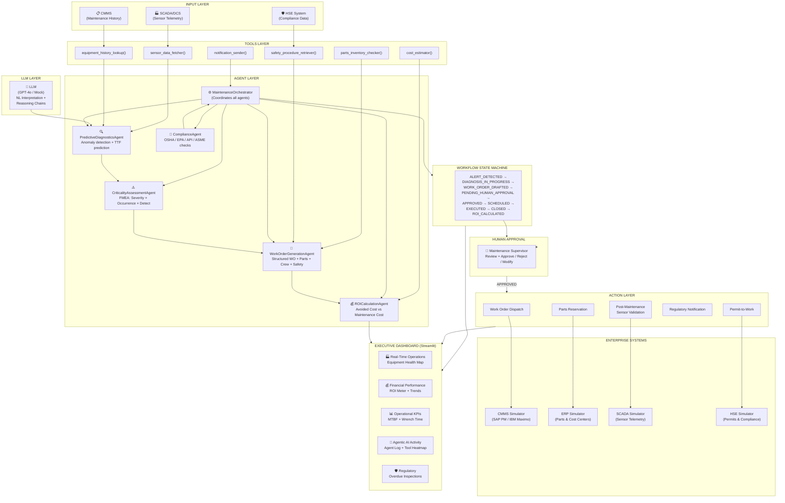

# Agentic Maintenance AI
### Chemicals & Petrochemicals — Critical Asset Management
### IBM Consulting | Agentic AI Demonstration System

---

## Architecture



---

## Use Cases Implemented

| # | Scenario | Equipment | Failure Mode | TTF |
|---|----------|-----------|-------------|-----|
| 1 | **Rotating Equipment Bearing Failure** | P-101 Crude Oil Pump | NDE Bearing vibration 8.4 mm/s | 48h |
| 2 | **Reactor Catalyst Fouling** | R-301 Hydrotreating Reactor | ΔP rise +58%, declining conversion | 336h |
| 3 | **Heat Exchanger Tube Leak** | E-401 Naphtha HX | Temperature cross + shell ΔP | 96h |
| 4 | **Compressor Valve Failure** | K-201 HP Gas Compressor | Discharge temp +28°C, efficiency -13% | 24h |
| 5 | **Safety Valve Compliance** | PSV-501 Reactor Overhead PSV | Inspection overdue 7 days (API 510) | Immediate |
| 6 | **Corrosion Under Insulation** | T-601 Crude Distillation Column | CUI risk score 0.78, 756 days since survey | Planned |

---

## Quick Start

> **Where to run these commands:**
> All commands below must be run from the **playground root** —
> the folder that *contains* `agentic_maintenance/` (i.e. where `run_demo.ps1` lives).
> In PowerShell: `cd C:\Users\PradeepLamba\.bob\playground`

---

### Option A — One-command launcher (PowerShell, run from anywhere)

```powershell
# Default scenario (bearing vibration anomaly)
.\run_demo.ps1

# All 6 scenarios
.\run_demo.ps1 --all

# Specific scenario
.\run_demo.ps1 --scenario reactor_fouling

# Interactive approval prompt
.\run_demo.ps1 --interactive

# Streamlit dashboard
.\run_demo.ps1 --dashboard

# Test suite
.\run_demo.ps1 --tests
```

---

### Option B — Manual (run from the playground root)

#### 1. Install dependencies

```powershell
pip install -r agentic_maintenance/requirements.txt
```

#### 2. Run the demo (no API key needed)

```powershell
# Default scenario
python -m agentic_maintenance.demo_runner

# All 6 scenarios
python -m agentic_maintenance.demo_runner --all

# Specific scenario
python -m agentic_maintenance.demo_runner --scenario reactor_fouling

# Interactive approval
python -m agentic_maintenance.demo_runner --scenario safety_valve_overdue --interactive
```

#### 3. Launch the Executive Dashboard

```powershell
streamlit run agentic_maintenance/dashboard/app.py
# Open: http://localhost:8501
```

#### 4. Run unit tests

```powershell
python -m pytest agentic_maintenance/tests/ -v
```

#### 5. Docker (one-command deployment)

```powershell
docker compose -f agentic_maintenance/docker-compose.yml up dashboard
docker compose -f agentic_maintenance/docker-compose.yml run --rm demo
docker compose -f agentic_maintenance/docker-compose.yml run --rm tests
```

---

## Configuration

All tunable parameters are in [`config.yaml`](config.yaml):

| Section | Key Parameters |
|---------|---------------|
| `system` | `offline_mode`, `log_level` |
| `financials` | `production_rate_usd_per_hour`, `product_margin_pct`, `ai_system_annual_cost_usd` |
| `sensor_thresholds` | Vibration, temperature, pressure alert/critical limits |
| `workflow` | `approval_timeout_minutes`, `escalation_recipient` |
| `notifications` | Email/SMS recipients by urgency level |
| `compliance` | PSV/CUI inspection intervals, regulatory bodies |
| `equipment_costs` | Planned vs emergency cost by equipment type |

**Online mode with OpenAI:**
```bash
export OPENAI_API_KEY=sk-...
# Edit config.yaml: system.offline_mode: false
python -m agentic_maintenance.demo_runner
```

---

## Project Structure

```
agentic_maintenance/
├── agents/
│   ├── orchestrator.py          ← MaintenanceOrchestrator (coordinates all agents)
│   ├── criticality_agent.py     ← FMEA scoring (Severity × Occurrence × Detectability)
│   ├── diagnostics_agent.py     ← Sensor anomaly detection + LLM narrative
│   ├── work_order_agent.py      ← Structured WO generation with parts + crew
│   ├── roi_agent.py             ← Financial impact: avoided cost vs maintenance cost
│   └── compliance_agent.py     ← OSHA / EPA / API / ASME compliance checks
├── tools/
│   ├── sensor_tools.py          ← sensor_data_fetcher()
│   ├── cmms_tools.py            ← equipment_history_lookup(), dispatch_work_order()
│   ├── inventory_tools.py       ← parts_inventory_checker(), cost_estimator()
│   ├── safety_tools.py          ← safety_procedure_retriever(), request_permit_to_work()
│   └── notification_tools.py   ← notification_sender()
├── enterprise_systems/
│   ├── cmms_simulator.py        ← SAP PM / IBM Maximo work order database
│   ├── erp_simulator.py         ← Spare parts inventory + cost centers
│   ├── scada_simulator.py       ← Statistical sensor telemetry with anomaly injection
│   └── hse_simulator.py         ← PTW, regulatory tracking, overdue inspections
├── workflow/
│   ├── state_machine.py         ← 9-state workflow FSM with full audit trail
│   └── approval_interface.py   ← Human supervisor approval CLI + escalation
├── dashboard/
│   └── app.py                   ← Streamlit Executive Dashboard (5 interactive panels)
├── roi/
│   └── roi_engine.py            ← ROI calculations + 12-month historical data
├── data/
│   ├── equipment_catalog.json   ← 10 equipment items (pumps, reactors, compressors, ...)
│   ├── sensor_profiles.json     ← Sensor thresholds + 6 anomaly scenarios
│   └── historical_incidents.json← (generated programmatically in roi_engine.py)
├── tests/
│   └── test_all.py              ← Unit tests for all components
├── config.yaml                  ← All tunable parameters
├── requirements.txt
├── Dockerfile
├── docker-compose.yml
├── demo_runner.py               ← End-to-end demo script
├── llm_client.py                ← OpenAI + Mock LLM clients
└── config_loader.py             ← YAML config loader with cache
```

---

## ROI Model

```
Avoided Unplanned Downtime Cost  = Downtime Hours Avoided × Production Rate × Margin
                                   = N hours × $85,000/h × 22%

Maintenance Cost                 = Labor Cost + Parts Cost + Contractor Cost
                                   = (Hours × $95/h) + Parts + (Contractor × $145/h)

Net Savings per Incident         = Avoided Downtime Cost − Planned Maintenance Cost

Cumulative Annual ROI            = Sum(Net Savings) / AI System Cost × 100%
                                   (AI System Annual Cost: $250,000)
```

**Sample Output (bearing_vibration_anomaly):**

| Metric | Value |
|--------|-------|
| Downtime Hours Avoided | 64 hours |
| Avoided Production Loss | $1,196,800 |
| Maintenance Cost | $9,450 |
| **Net Savings** | **$1,187,350** |
| **ROI** | **12,564%** |

---

## Agentic Pipeline Flow

```
[SCADA ALERT]
    │
    ▼
[Stage 1] sensor_data_fetcher()      → Raw telemetry with anomaly injection
[Stage 2] equipment_history_lookup() → MTBF, failure history
[Stage 3] PredictiveDiagnosticsAgent → LLM narrative + failure mode + TTF
[Stage 4] CriticalityAssessmentAgent → FMEA RPN → Criticality level
[Stage 5] ComplianceAgent            → OSHA/EPA/API violation check
[Stage 6] parts_inventory_checker()  → Availability + lead times
[Stage 7] safety_procedure_retriever() → JSA + PTW requirements
[Stage 8] cost_estimator()           → Total maintenance cost
[Stage 9] WorkOrderGenerationAgent   → Structured WO with all fields
[Stage 10] ROICalculationAgent       → Net savings + ROI%
[Stage 11] dispatch_work_order()     → WO saved to CMMS
[Stage 12] notification_sender()     → Email/SMS to supervisor
[Stage 13] PENDING_HUMAN_APPROVAL    → Supervisor reviews AI recommendation
[Stage 14] Human Decision            → APPROVED / REJECTED / MODIFIED
[Stage 15] request_permit_to_work()  → PTW issued
[Stage 16] EXECUTED                  → Field team action
[Stage 17] Post-maintenance validation → Sensor confirmation
[Stage 18] ROI_CALCULATED            → Dashboard updated
```

---

## Demo Walkthrough Script

```bash
# 1. Start with the flagship scenario (5-minute demo)
python -m agentic_maintenance.demo_runner --scenario bearing_vibration_anomaly

# 2. Observe in terminal:
#    - LLM interpreting the vibration alert in natural language
#    - Each agent activating in sequence with logged reasoning
#    - Tool calls to CMMS, inventory, safety systems
#    - Auto-approval with financial impact display
#    - Final ROI summary report

# 3. Open dashboard (in separate terminal)
streamlit run agentic_maintenance/dashboard/app.py
# → http://localhost:8501

# 4. In dashboard sidebar, run additional scenarios:
#    compressor_valve_failure → EMERGENCY priority, immediate action
#    safety_valve_overdue     → Compliance violation, regulatory notification
#    reactor_fouling          → Long-term planning, catalyst change

# 5. Observe dashboard updating:
#    - Equipment Health Map turning RED/AMBER
#    - ROI gauge ticking up
#    - Agent Decision Log scrolling
#    - Workflow pipeline status updating
```

---

## Compliance Framework

| Standard | Coverage |
|----------|---------|
| OSHA 1910.147 | LOTO (Lockout/Tagout) procedures |
| OSHA 1910.119 | Process Safety Management (PSM) |
| OSHA 1910.146 | Confined Space Entry |
| API 510 | Pressure Vessel Inspection (PSV) |
| API 581 | Risk-Based Inspection (CUI) |
| ASME BPVC Sec VIII | Pressure Equipment Repair |
| NFPA 54 | Hot Work in Flammable Atmospheres |
| ISO 10816 | Rotating Equipment Vibration Limits |

---

*Built with IBM Bob | Agentic Maintenance AI v1.0 | IBM Consulting*
